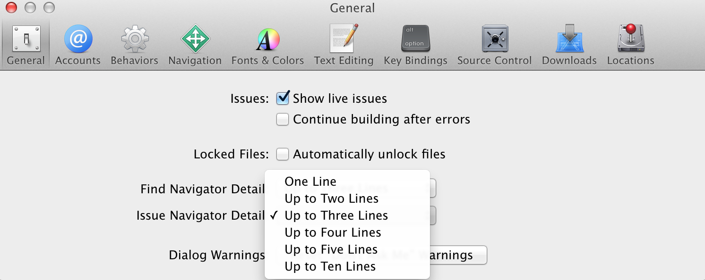
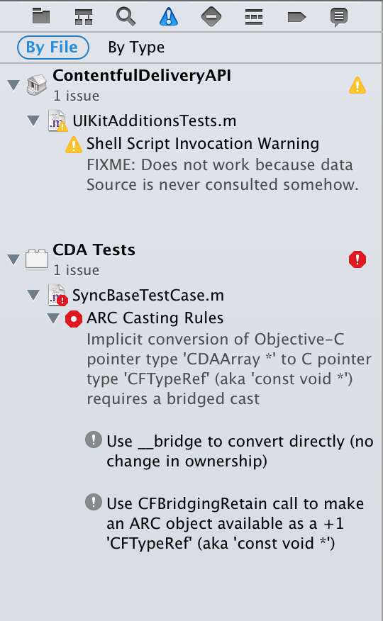

Xcode 5.1 fixes the issue navigator, so you won't need this plugin anymore. It just stays here mostly for historical purposes or if you want to see more than ten lines of your issues. If you still use it, make sure to set the option to at least "Two Lines" or the plugin will not function correctly.

---

Xcode plugin for showing all issue content in the issue navigator. No more ellipsis!

Consider this an early prototype, it works, but the implementation is hacky and calculates larger heights for the issue navigator cells than necessary.

## Installation

Either

- Clone and build the plugin yourself, it will be installed to the right location automatically by building it.

or

- Install it via [Alcatraz](http://alcatraz.io/)

In any case, relaunch Xcode to load it.

## Help needed

Follow [@NeoNacho](https://twitter.com/NeoNacho) to help me beat [@orta](https://twitter.com/orta) in followers count.
